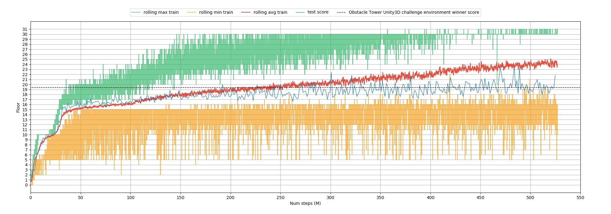

Unity 3D Obstacle Tower Environment
===================================

This page covers how to use PyTorchRL to train an agent on the Obstacle Tower Unity3D challenge environment :footcite:`juliani2019obstacle`, a procedurally generated 3D world where an agent must learn to navigate an increasingly difficult set of floors (up to 100) with varying lightning conditions and textures. Each floor can contain multiple rooms, and each room can contain puzzles, obstacles or keys enabling to unlock doors. The number and arrangement of rooms in each floor for a given episode can be fixed with a seed parameter.

.. raw:: html

   <iframe width="560" height="315" src="https://www.youtube.com/embed/L442rrVnDr4" frameborder="0" allow="accelerometer; autoplay; clipboard-write; encrypted-media; gyroscope; picture-in-picture" allowfullscreen></iframe>
|

The Environment
---------------

We define an ``env_factory`` function with 5  wrappers.

.. code-block:: python

    def obstacle_train_env_factory(
            index_worker=0, rank=0, frame_skip=0, frame_stack=1, min_floor=0,
            max_floor=50, reduced_actions=True, reward_shape=True):
        """
        Create train Obstacle Tower Unity3D environment.
        Useful info_keywords 'floor', 'start', 'seed'.
        Parameters
        ----------
        frame_skip : int
            Return only every `frame_skip`-th observation.
        frame_stack : int
            Observations composed of last `frame_stack` frames stacked.
        min_floor : int
            Minimum floor the agent can be spawned in.
        max_floor : int
            Maximum floor the agent can be spawned in.
        reduced_actions : bool
            Whether or not to use the action wrapper to reduce the number of available actions.
        reward_shape : bool
            Whether or not to use the reward shape wrapper.
        Returns
        -------
        env : gym.Env
            Train environment.
        """
        if 'DISPLAY' not in os.environ.keys():
            os.environ['DISPLAY'] = ':0'

        exe = os.path.join(os.path.dirname(
            obstacle_tower_env.__file__), 'ObstacleTower/obstacletower')

        env = ObstacleTowerEnv(
            environment_filename=exe, retro=True, worker_id=index_worker + rank,
            greyscale=False, docker_training=False, realtime_mode=False)

        if reduced_actions:
            env = ReducedActionEnv(env)

        env = BasicObstacleEnv(env, max_floor=max_floor, min_floor=min_floor)

        if reward_shape:
            env = RewardShapeObstacleEnv(env)

        if frame_skip > 0:
            env = FrameSkip(env, skip=frame_skip)

        if frame_stack > 1:
            env = FrameStack(env, k=frame_stack)

        return env

The ``ReducedActionEnv`` wrapper reduces the Agent's action set from the initial 54 actions to 6 (rotate camera in both directions, go forward, and go forward while turning left, turning right or jumping). The ``BasicObstacleEnv`` wrapper restarts each new episode at a randomly selected floor between 0 and the higher floor reached in the previous episode and adds some informative keywords to track training progress. The ``RewardShapeObstacleEnv`` wrapper adds some rewards shaping. The reward received from the environment upon the agent completing a floor is +1, and +0,1 is provided for opening doors, solving puzzles, or picking up keys. We additionally reward the agent with an extra +1 to pick up keys, +0.002 to detect boxes, +0.001 to find box intended locations, +1.5 to place the boxes target locations and +0.002 for any event that increases remaining time. The ``FrameSkip`` wrapper skips game frames intermittently, repeating the last action and accumulating the reward. We use frame skip 2. The ``FrameStack`` wrapper stacks consecutive frames. We use frame stack 4. Code can be found `here. <https://github.com/PyTorchRL/pytorchrl/blob/master/pytorchrl/envs/obstacle_tower_unity3d_challenge/wrappers.py>`_

The Agent
---------

We define an RL On-Policy Agent, using the Proximal Policy Optimization (PPO) :footcite:`schulman2017proximal` algorithm and a Storage with Generalized Advantage Estimation (GAE) :footcite:`gae`. We use a feature extractor with the network architecture proposed in :footcite:`espeholt2018impala` but we initialize its weights according to Fixup :footcite:`zhang2019fixup`. We end our network with a gated recurrent unit (GRU) :footcite:`gru` with a hidden layer of size 256 neurons.

.. code-block:: python

    from pytorchrl.agent.algos import PPO
    from pytorchrl.agent.env import VecEnv
    from pytorchrl.agent.storages import GAEBuffer
    from pytorchrl.agent.actors import OnPolicyActor, get_feature_extractor
    from pytorchrl.envs import obstacle_train_env_factory

    # Define Train Vector of Envs
    envs_factory, action_space, obs_space = VecEnv.create_factory(
        env_fn=obstacle_train_env_factory,
        env_kwargs={"frame_skip": 2, "frame_stack": 4},
        vec_env_size=8, log_dir='/tmp/obstacle_tower_agent',
        info_keywords=('floor', 'start', 'seed'))

    # Define RL training algorithm
    algo_factory = PPO.create_factory(
        lr=2.5e-5, num_epochs=2, clip_param=0.15, entropy_coef=0.01,
         value_loss_coef=0.2, max_grad_norm=0.5, num_mini_batch=8,
        use_clipped_value_loss=True, gamma=0.99)

    # Define RL Policy
    actor_factory = OnPolicyActor.create_factory(
        obs_space, action_space,
        feature_extractor_network=get_feature_extractor("Fixup"),
        recurrent_policy=True)

    # Define rollouts storage
    storage_factory = GAEBuffer.create_factory(size=800, gae_lambda=0.95)

The Scheme
----------

We train on 2 machines with 32 CPUs and 3 GPUs model GeForce RTX 2080 Ti each. We define a distributed training scheme with 2 synchronized gradient workers that average their gradients before updating the actor model. Each gradient worker is fed with data collected by 4 collector workers with asynchronous coordination (never remain idle).

.. code-block:: python

    from pytorchrl.scheme import Scheme

    # 6. Define scheme
    params = {}

    # add core modules
    params.update({
        "algo_factory": algo_factory,
        "actor_factory": actor_factory,
        "storage_factory": storage_factory,
        "train_envs_factory": envs_factory,
    })

    # add collection specs
    params.update({
        "num_col_workers": 4,
        "col_communication": "asynchronous",
        "col_worker_resources": {"num_cpus": 1, "num_gpus": 0.5, "object_store_memory": 2.5 * 1024 ** 3, "memory": 2.5 * 1024 ** 3},
    })

    # add gradient specs
    params.update({
        "num_grad_workers": 2,
        "grad_communication": "synchronous",
        "grad_worker_resources": {"num_cpus": 32 - 4, "num_gpus": 1.0, "object_store_memory": 2.5 * 1024 ** 3, "memory": 2.5 * 1024 ** 3},
    })

    scheme = Scheme(**params)

Training
--------

We decay the starting learning rate value of 4e-4  by a factor of 0.25 both after 100 million steps and 400 million steps.

.. code-block:: python

    # 7. Define learner
    learner = Learner(scheme, target_steps=600000000, log_dir='/tmp/obstacle_tower_agent')

    # 8. Define train loop
    num_lr_updates = 0
    start_time = time.time()
    while not learner.done():

        learner.step()
        learner.print_info()

        if iterations % args.save_interval == 0:
            save_name = learner.save_model()

        if Learner.num_samples_collected > 100000000 and num_lr_updates=0:
            Learner.update_algo_parameter("lr", 4e-4 * 0.25)
            num_lr_updates += 1
        elif Learner.num_samples_collected > 400000000 and num_lr_updates=1:
            Learner.update_algo_parameter("lr", 4e-4 * 0.25 ** 2)
            num_lr_updates += 1

Results
-------

We train our agent on a fixed set of seeds [0, 100) for approximately 11 days and test its behaviour on seeds 1001 to 1005, a procedure designed by the authors of the challenge to evaluate weak generalization capacities of RL agents :footcite:`juliani2019obstacle`. Test performance is measured as the highest averaged score on the five test seeds obtained after 5 attempts, due to some intrinsic randomness in the environment. Our maximum average test score is 23.6, which supposes a significant improvement with respect to 19.4, the previous state-of-the-art obtained by the winner of the competition. Our results are show that we are also consistently above 19.4.

.. footbibliography::
