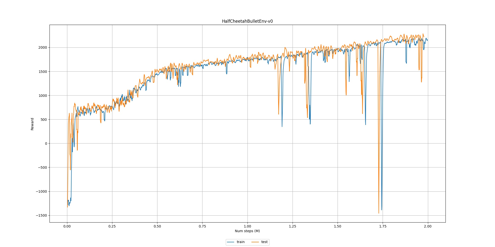

Training on PyBullet envs with SAC
==================================

In this page we provide some code examples intended to work out-of-the-box to train and visualize RL agents on PyBullet environments.

They can be directly executed from the `source repo <https://github.com/PyTorchRL/pytorchrl>`_ root directory. That might require adding the repo to the ``PYTHONPAH`` running ``export PYTHONPATH="${PYTHONPATH}:${PWD}"`` also from the root directory. If pytorchrl has been installed with PyPI, the scripts can also be copied to any location and executed from there.

Configuration
-------------

We use a .yaml configuration file to define environment, algorithmic and scheme variables.

.. literalinclude:: ../../../code_examples/train_pybullet/sac/conf.yaml
  :language: yaml
  :caption: code_examples/train_pybullet/sac/conf.yaml

Training the Agent
------------------

Use the train.sh script to train the agent using the current configuration. If sripts are not executed from source, change the highlighted line to match the current path.

.. literalinclude:: ../../../code_examples/train_pybullet/sac/train.sh
  :language: bash
  :caption: code_examples/train_pybullet/sac/train.sh
  :emphasize-lines: 2

.. literalinclude:: ../../../code_examples/train_pybullet/sac/train.py
  :language: python
  :caption: code_examples/train_pybullet/sac/train.py

Plotting the reward
-------------------

Use the plot.sh script to plot reward progression during training. If sripts are not executed from source, change the highlighted line to match the current path. The plot.py script will look for training logs in the log_dir variable from conf.yaml. If the logs directory name or path has been modified after training, you can simply modify conf.yaml.

.. literalinclude:: ../../../code_examples/train_pybullet/sac/plot.sh
  :language: bash
  :caption: code_examples/train_pybullet/sac/plot.sh
  :emphasize-lines: 2

.. literalinclude:: ../../../code_examples/train_pybullet/sac/plot.py
  :language: python
  :caption: ode_examples/train_pybullet/sac/plot.py

Visualizing the trained agent
-----------------------------

.. literalinclude:: ../../../code_examples/train_pybullet/sac/enjoy.sh
  :language: bash
  :caption: code_examples/train_pybullet/sac/plot.sh
  :emphasize-lines: 2

.. literalinclude:: ../../../code_examples/train_pybullet/sac/enjoy.py
  :language: python
  :caption: code_examples/train_pybullet/sac/plot.py