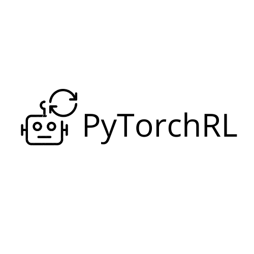

PyTorchRL Documentation
=======================

..
    Nowhere in this documentation is the identity of the authors
    disclosed. However github links should not be followed to
    preserve anonymous review. On the other hand, other people
    are using the tool and the links must remain there for the
    use of everybody else.

.. toctree::
   :maxdepth: 2
   :caption: Getting started:

   usage/introduction
   usage/installation
   usage/breaking_down_pytorchrl
   usage/high_level_code_examples

.. toctree::
   :maxdepth: 2
   :caption: PyTorchRL API:

   package/agent/agent
   package/training/training

.. toctree::
   :maxdepth: 2
   :caption: Tutorials:

   tutorials/feature_extractor_tutorial
   tutorials/new_components_tutorial
   tutorials/custom_environment_tutorial

.. toctree::
   :maxdepth: 2
   :caption: Code examples:

   code_examples/atari
   code_examples/pybullet
   code_examples/obstacle

.. toctree::
   :maxdepth: 2
   :caption: Benchmarks:

   benchmarks/benchmarks
