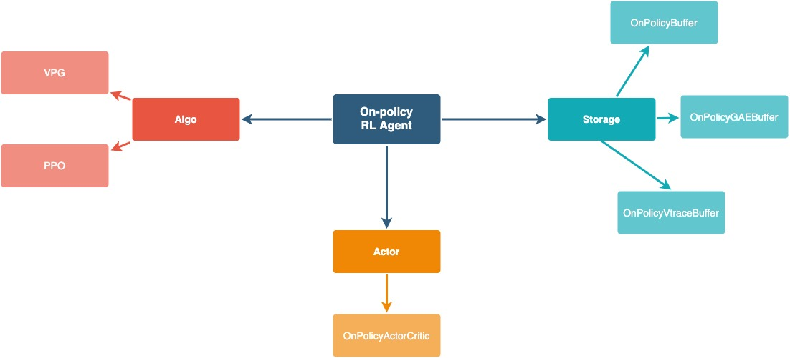
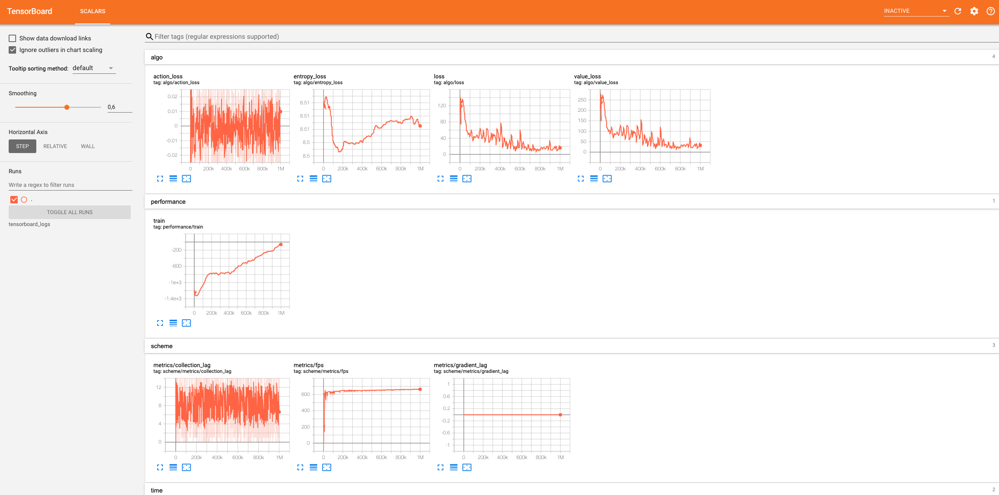

Getting started
===============

This page covers how to run a basic experiment using Nappo.

- :ref:`1. Starting a training script`
- :ref:`2. Defining a vectorized environment`
- :ref:`3. Defining a RL agent`
- :ref:`4. Customizing training scheme`
- :ref:`5. Executing training loop`
- :ref:`6. Checking results`

1. Starting a training script
-----------------------------

Nappo uses Ray distributed framework internally to define and assign the available compute resources to the processes handling RL training. For that reason, it is important to initialize Ray at the beginning of every training script. In this example, we will initialize Ray on a single machine by simply calling ``ray.init()``, but it can be initialized on clusters of arbitrary size. To do so, see the `official Ray documentation. <https://docs.ray.io/en/releases-0.8.6/starting-ray.html>`_

Nappo also uses multiprocessing, so it is important to define our script as the entry point of the program with ``if __name__ == "__main__":``.

.. code-block:: python

    if __name__ == "__main__":

        import ray
        ray.init()

2. Defining a vectorized environment
------------------------------------

The first step to train a RL agent is defining an environment to interact with. However this a somewhat special type of component, because we would normally want multiples copies of it. More specifically, we would normally want to stack multiple independent environments into a single one to make a more efficient use of compute resources during inference time.

To do that, we start defining a function that creates single copies of the environment under consideration. We will refer to it as the ``env_factory``. Following, we can create a vectorized environment with the ``VecEnv`` component, which uses the ``env_factory`` to create multiples instances of the environment and stacks them. Nappo already contains ``env_factory`` functions to create some popular environments, such as ``Pybullet``, ``Atari`` and ``MuJoCo``, so we can import one of those.

.. code-block:: python

        from nappo.envs import pybullet_train_env_factory

Nonetheless, here we have a slightly simplified version of the code we just imported. The complete version can be found `here. <https://github.com/nappo/nappo/blob/master/nappo/envs/pybullet/pybullet_env_factory.py>`_

.. code-block:: python

        import gym
        import pybullet_envs

        def pybullet_train_env_factory(env_id, seed=0):
            env = gym.make(env_id)
            env.seed(seed)
            return env

As we can see, the function returns a ``gym.Env`` instance, so defining a version of this function for any other environment adapted to work with the OpenAI Gym interface is straightforward. Any ``gym.Wrappers`` can be added here as well. We can even define a different ``env_factory`` for training and for testing our RL agent, with different wrappers in each one. We won't define a ``env_factory`` for testing in this tutorial, as it is not necessary.

.. code-block:: python

        from nappo.core.env import VecEnv

        # Define Environment Vector
        train_envs_factory, action_space, obs_space = VecEnv.create_factory(
            vec_env_size=1,
            log_dir="/tmp/train_example",
            env_fn=make_pybullet_train_env,
            env_kwargs={"env_id": "HalfCheetahBulletEnv-v0"})

Similar to how the environment is instantiated many times to create a vectorized enironments, being able to scale to distributed regimes can require RL agent components to be instantiated multiple times in different processes.
Therefore, we can use a similar logic. Nappo core components contain a specifically named class method, called ``create_factory``, which returns a function allowing to create component instances, a ``component_factory``.

Instead of directly defining a single RL agent instance, we can define a ``component_factory`` for each component and pass them on to the training architecture component called ``Scheme``, which will handle the creation of any training architecture we specify later on.

To continue with our example, we use the ``VecEnv.create_factory()`` method to create a factory of vectorised environments. This function takes in the ``env_factory``, any ``kwargs`` we want to define for it, and the ``vec_env_size`` or number of copies we want to stack together.

.. note::
   The ``VecEnv.create_factory()`` method accepts an optional parameter called ``log_dir``. If provided, a ``gym.Monitor`` wrapper will be used to generate json log files for each individual environment in the vector.

3. Defining a RL agent
----------------------

Nappo subscribes the idea that composable agents are the best option to enable method experimentation. Individual components are easier to read, understand and modify. They also allow for method flexibility, as they can be combined in different ways.

Nappo distinguishes between 3 types of Agent components: the ``Algo``, which manages loss and gradient computation, the ``Actor``, implementing the deep neural networks used as function approximators, and the ``Storage``, which handles data storage, processing and retrieval. Selecting an instance of each class and combining them we can create an agent.

Our current implementation contains the following components.

.. image:: ../images/off_policy_rl_agents.jpg
  :width: 700
  :alt: Agent core components

New components can be created and combined with already existing ones. For more information about how to do it, see :ref:`Create a custom core component`.

For our example, we can create an On-Policy Agent, using the Proximal Policy Optimization (PPO) algorithm, a Storage with Generalized Advantage Estimation (GAE) and an Actor Critic using MLP networks as feature extractors. To see the list of available feature extractors check the :ref:`Feature Extractors` section.

.. code-block:: python

        from nappo.core.algos import PPO
        from nappo.core.storages import OnPolicyGAEBuffer

        # Define RL training algorithm
        algo_factory = PPO.create_factory(
            lr=1e-4, num_epochs=4, clip_param=0.2, entropy_coef=0.01,
            value_loss_coef=.5, max_grad_norm=.5, num_mini_batch=4,
            use_clipped_value_loss=True, gamma=0.99)

        # Define rollouts storage
        storage_factory = OnPolicyGAEBuffer.create_factory(size=1000, gae_lambda=0.95)

.. note::
    Custom feature extractors can also be defined. For a more detailed explanation about how to do it, check :ref:`Create custom feature extractors`.

4. Customizing training scheme
------------------------------

Deep RL algorithms are generally based on the repeated execution of three sequentially ordered operations: rollout collection (R), gradient computation (G) and policy update (U). In single-threaded implementations, all operations are executed within the same process and training speed is limited by the performance that the slowest operation can achieve with the resources available on a single machine. Furthermore, these algorithms don't have regular computation patterns (e.i. while rollout collection is generally limited by CPU capacity, gradient computation is often GPU bounded), causing an inefficient use of the available resources.

To alleviate computational bottlenecks, we can parallelize operation or even allow consecutive operations to be executed asynchronously. Even within the computational budged of a single machine, this solution enables a more efficient use of compute resources at the cost of some deviation from the original problem formulation. Furthermore, if actors can communicate across a distributed cluster as it is the case, this approach allows to leverage the combined computational power of multiple machines.

Nappo contains a distributed component called ``Scheme`` which takes in the component factories as input parameters and allows to define the training architecture. More specifically, the ``Scheme`` class allows to specify how many processes work computing gradients to update the network, and whether this workers have a asynchronous communication pattern, passing on the gradients to the process in charge of updating the actor as soon as they have finished, or a synchronous one, waiting for all other workers to finish before sending all gradients at once. Similarly, the architecture can be further parametrized by specifying how many workers collect data from the environment to feed each gradient workers, and also if these workers synchronize or not.

.. code-block:: python

        from nappo.schemes import Scheme

        # Core components params
        scheme_parameters = {
            "algo_factory": algo_factory,
            "actor_factory": actor_factory,
            "storage_factory": storage_factory,
            "train_envs_factory": train_envs_factory}

        # Collection operation params
        scheme_parameters.update({
            "col_remote_workers": 0, # only a local worker
            "col_communication": "synchronous"})

        # Gradient computation operation params
        scheme_parameters.update({
            "grad_remote_workers": 0, # only a local worker
            "col_communication": "synchronous"})

        scheme = Scheme(**scheme_parameters)

.. note::
   Note that ``Scheme`` has two parameters called ``col_remote_workers`` and ``grad_remote_workers``. When these parameters are set to 0, data collections and gradient computation operations are not parallelized, and the training script in executed by a single process. We can increase their values to scale to more complex architectures to achieve faster training times. However, going back to a single-threaded implementation can be useful if we want to create new components and need to debug them.

5. Executing training loop
--------------------------

Finally, another class, called the ``Learner``, helps us to define the training loop. The ``Learner`` class takes the ``Scheme``, the target number of steps to train and, optionally, a path where to store the training logs ``log_dir`` as input parameters.

.. code-block:: python

        from nappo import Learner

        # 6. Define learner
        learner = Learner(scheme, target_steps=1000000, log_dir="/tmp/train_example")

        # 7. Define train loop
        iterations = 0
        while not learner.done():
            learner.step()
            if iterations % 1 == 0:
                learner.print_info()
            if iterations % 100 == 0:
                save_name = learner.save_model()
            iterations += 1

6. Checking results
-------------------

During training, saved models and Tensorboard logs are stored in the ``Learner``'s ``log_dir``. Therefore, we can visualize our logs with the following command line::

    tensorboard --logdir=/tmp/train_example/tensorboard_files --port=8888

And enjoy our Agent's performance with running this script:

.. code-block:: python

    from nappo.envs import pybullet_train_env_factory
    from nappo.core.actors import OnPolicyActorCritic, get_feature_extractor

    device = torch.device("cpu")
    env = pybullet_train_env_factory(env_id="HalfCheetahBulletEnv-v0")
    policy = OnPolicyActorCritic.create_factory(
        env.observation_space, env.action_space,
        feature_extractor_network=get_feature_extractor("MLP"),
        restart_model="/tmp/train_example/actor_critic.state_dict")(device)

    env.render()
    obs = env.reset()
    done, episode_reward = 0, False
    rhs = torch.zeros(1, policy.recurrent_hidden_state_size).to(device)

    while not done:
        obs = torch.Tensor(obs).view(1, -1).to(device)
        done = torch.Tensor([done]).view(1, -1).to(device)
        with torch.no_grad():
            _, clipped_action, _, rhs, _ = policy.get_action( obs, rhs, done, deterministic=True)
        obs, reward, done, info = env.step(clipped_action.squeeze().cpu().numpy())
        episode_reward += reward

        if done:
            print("EPISODE: reward: {}".format(episode_reward), flush=True)
            done, episode_reward = 0, False
            env.render()
            obs = env.reset()